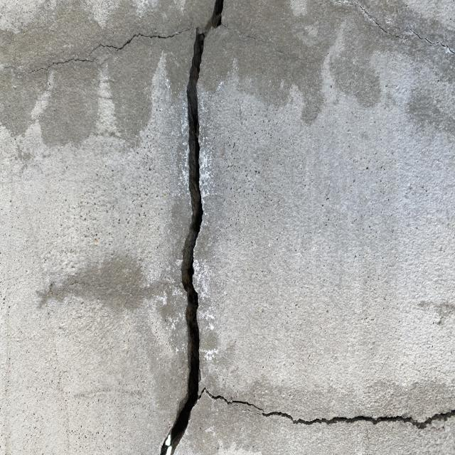
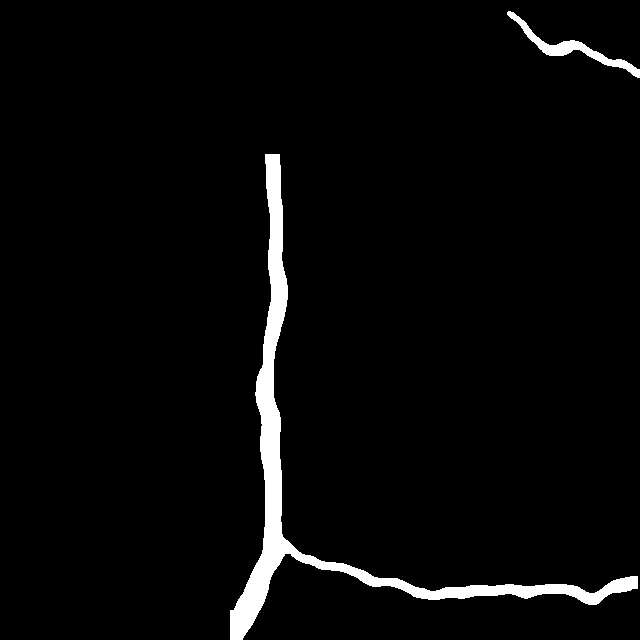
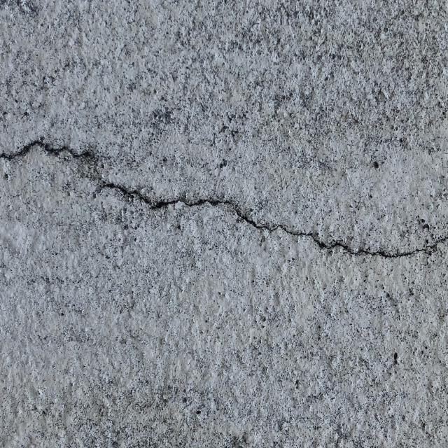
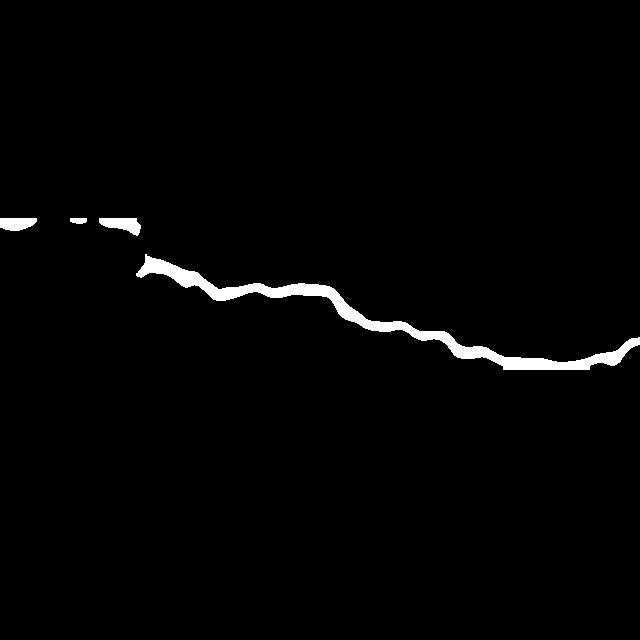
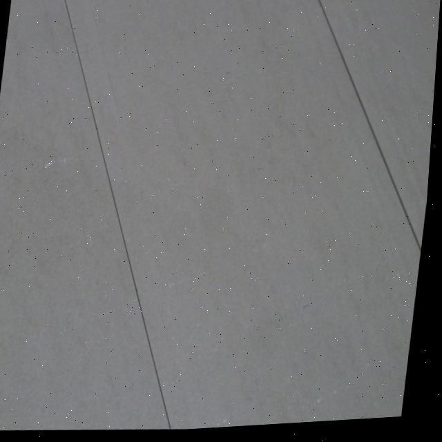
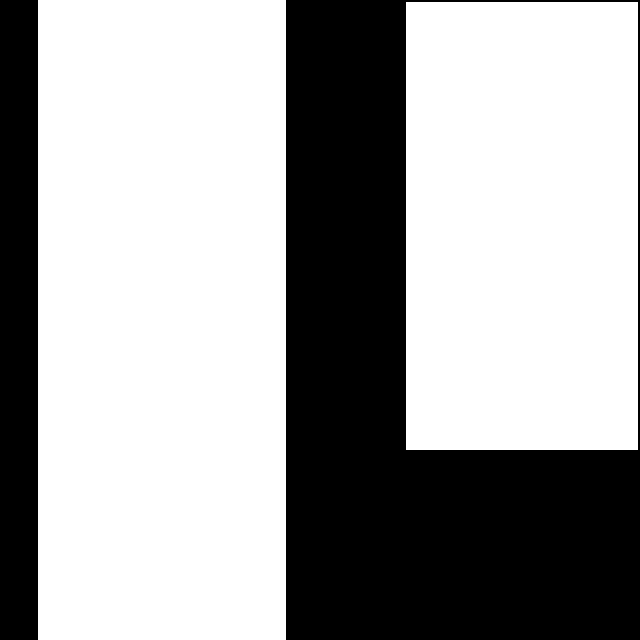
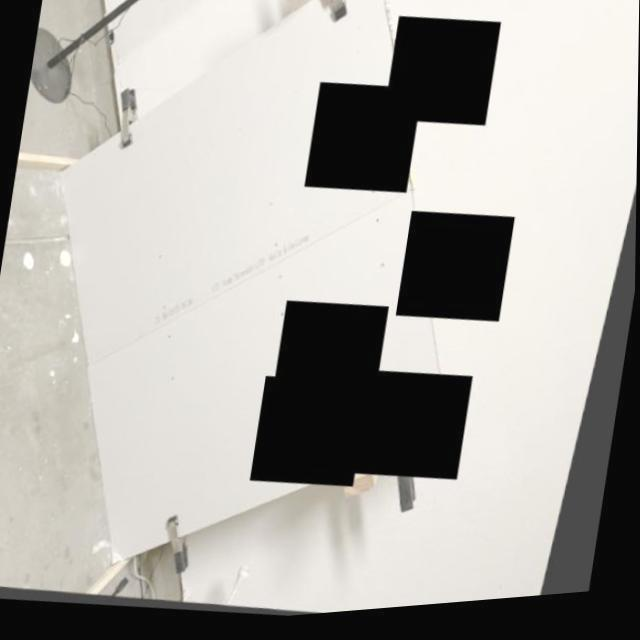
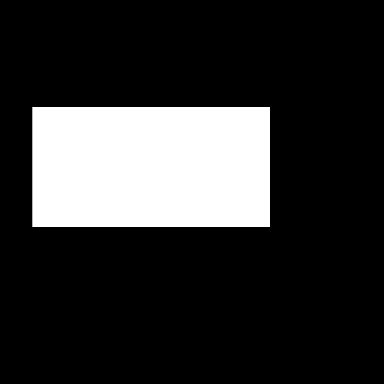

# Prompted Segmentation for Drywall QA

## Goal

Binary segmentation masks from text prompts across two construction fault datasets, without retraining for new categories.
- `"segment taping area"` on Dataset 1 (Drywall-Join-Detect)
- `"segment crack"` on Dataset 2 (Cracks)
---

## Datasets & Splits

| Split | Dataset 1 · Taping | Dataset 2 · Cracks | Combined |
|-------|-------------------|-------------------|----------|
| Train  | 820 | 627 | 1,447 |
| Valid  | 202 | 60 | 262 |
| Test   | 0 | 30 | 30 |

Dataset 1 detection labels `(cx, cy, w, h)` were converted to 4-corner rectangular polygons because pixel-accurate segmentation annotations were unavailable.

Dataset 2 was augmented from 299 source images using crop (0–20%), rotation (±15deg), shear (±10°), and blur (up to 2.5 px). Class IDs were remapped `0 -> 1` before merging.

## Approach Summary

**YOLOE (v26)**
- Open-vocabulary segmentation via CLIP text embeddings
- Mean mIoU 0.6533, mean Dice 0.7639 on 262 validation images
- Taping: mIoU 0.7724, Dice 0.8489
- Cracks: mIoU 0.5342, Dice 0.6789
- Generalises across paraphrased prompts without retraining
- Model at `models/best.pt`

**Qwen3-VL-4B (qLoRA, 1 epoch)**
- Segmentation as a vision-language task: outputs polygon coordinates in JSON
- 4-bit quantised, 39.3 M trainable params (0.88% of 4.48 B)
- Training loss: 1.51 → 0.69 in 109 steps (~28 min on L4)
- Evaluation metrics pending
- [`skaturanus/drywall-segment-vl`](https://huggingface.co/skaturanus/drywall-segment-vl)

---

## Approach 1: YOLOE

YOLOE was chosen for open-vocabulary segmentation. Its CLIP text encoder maps class names and visual features into a shared embedding space, so the detection head matches regions by semantic similarity rather than integer class index. Adding a new fault category at inference requires only a new string.

### Prompt embedding

`model.get_text_pe(names)` encodes class names once into `fault-pe.pt`. `YOLOEPESegTrainer` injects these embeddings into the head at every training step, keeping the model text-conditioned while removing the CLIP encoder from the training loop.

Two models with different backbones were trained to compare cost vs. accuracy:

| Run | Checkpoint | Strategy |
|-----|-----------|----------|
| v11 | `yoloe-11s-seg.pt` | Linear probing: backbone frozen, only `cv3` projection weights trained |
| v26 | `yoloe-26s-seg.pt` | Full head fine-tune (Ultralytics release) |

Linear probing preserves COCO-pretrained features and updates only the class-projection weights. This reduces overfitting risk on a small domain dataset, but was not enough to learn the new classes. The v26 run uses a larger, fully trainable head instead.

**Hyperparameters:** AdamW, lr0=1e-3, batch=16, 80 epochs, patience=10, weight\_decay=0.025, mosaic off for final 5 epochs. **Seed:** `PYTHONHASHSEED=42`.

Trained on Tesla T4 GPU.

### Evaluation (v26, validation split, 262 images)

| Prompt | mIoU | Dice |
|--------|------|------|
| segment drywall taping area | 0.7724 | 0.8489 |
| segment wall crack | 0.5342 | 0.6789 |
| **Mean** | **0.6533** | **0.7639** |

Baseline (pre-trained `yoloe-26s-seg.pt`, no fine-tuning) scored mIoU 0.0430 / Dice 0.0695 on the same split, confirming domain shift from COCO.

Output masks are single-channel PNGs `{0, 255}`.

### Prompt divergence

Training used `['drywall taping area', 'wall crack']`, but evaluation used different labels via `model.set_classes(['drywall seam', 'crack'])`. The metrics above were measured under this mismatch. CLIP's shared embedding still matched the correct regions, showing that YOLOE generalises across paraphrased prompts without retraining.

### Predictions

**Cracks**

| Original | Predicted mask |
|----------|---------------|
|  |  |
|  |  |

**Taping areas**

| Original | Predicted mask |
|----------|---------------|
|  |  |
|  |  |

### Known issues

- Rectangular polygon approximation limits accuracy on thin tape lines and irregular crack boundaries, since ground-truth labels are bounding-box rectangles.
- Linear probing may underfit when construction imagery diverges significantly from COCO pre-training. Unfreezing later backbone stages could recover accuracy.

## Approach 2: Qwen3-VL

Qwen3-VL-4B-Instruct treats segmentation as a vision-language task: given an image and a text prompt, the model outputs polygon coordinates in JSON instead of a raster mask. This allows arbitrary polygon shapes described via natural language.

### Data preparation

YOLO segmentation labels (class ID + normalised polygon vertices) were converted to chat-style JSONL. Each entry pairs an image with a randomised prompt variant from a per-class pool:

- Class 0 (taping): `"segment taping area"`, `"segment joint/tape"`, `"segment drywall seam"`
- Class 1 (crack): `"segment crack"`, `"segment wall crack"`, `"wall crack"`

Each prompt is suffixed with `"…in this image and output the segmentation coordinates (polygon) in JSON format."` The expected response is `{"polygon": [[x,y], ...]}` or `{"polygons": [...]}` for multi-instance images. 1,737 training entries were generated across both datasets.

### Fine-tuning

Unsloth's `FastVisionModel` loads the base model in 4-bit (BnB) with LoRA adapters:

| Parameter | Value |
|-----------|-------|
| Base model | `unsloth/Qwen3-VL-4B-Instruct-unsloth-bnb-4bit` |
| LoRA rank / alpha | 16 / 16 |
| Trainable params | 39.3 M of 4.48 B (0.88%) |
| Finetune targets | vision + language, attention + MLP |
| Optimizer | AdamW 8-bit |
| Learning rate | 2e-4, linear schedule |
| Batch size | 4 × 4 gradient accumulation = 16 effective |
| Epochs | 1 (109 steps) |
| Training time | ~28 min on NVIDIA L4 |
| Seed | 3407 |

Training loss dropped from 1.51 (step 1) to ~0.69 (step 109).

### Metrics

| Prompt | mIoU | Dice |
|--------|------|------|
| segment drywall taping area | 0.2286 | 0.3250 |
| segment wall crack | Pending | Pending |
| **Mean** | **Pending** | **Pending** |

### Output

Merged 16-bit weights pushed to [`skaturanus/drywall-segment-vl`](https://huggingface.co/skaturanus/drywall-segment-vl) on HuggingFace.